# 🚀 SalesScope Analytics Lab

<div align="center">


**A Comprehensive Containerized End-to-End Sales Data Analytics Platform**

*Transform raw CSV data into actionable business insights using Docker, Python, PostgreSQL, and advanced SQL analytics*

</div>

---

## 📋 Table of Contents

- [🎯 Project Overview](#-project-overview)
- [🏗️ Architecture](#️-architecture)
- [🚀 Quick Start](#-quick-start)
- [🐳 Docker Services](#-docker-services)
- [📊 Analytics Capabilities](#-analytics-capabilities)
- [🛠️ Installation Guide](#️-installation-guide)
- [📈 Usage Manual](#-usage-manual)
- [🔧 Troubleshooting](#-troubleshooting)
- [🎯 Business Value](#-business-value)

---

## 🎯 Project Overview

<div align="center">

### 🌟 **Containerized Data Engineering Pipeline**

</div>

SalesScope Analytics Lab is a **production-ready**, **enterprise-grade** containerized data analytics platform that demonstrates:

- 🐳 **Docker-Powered Architecture** for environment consistency
- 📊 **Advanced SQL Analytics** with PostgreSQL 
- 🐍 **Python Data Processing** with Pandas & Jupyter
- 🔄 **Automated CI/CD Ready** deployment
- 📈 **Real Business Intelligence** insights generation

> **Key Differentiator**: Complete containerization makes this project production-ready and enterprise-scalable, demonstrating real-world deployment capabilities beyond typical analytics projects.

---

## 🏗️ Architecture

```mermaid
graph TB
    A[📁 CSV Data] --> B[🐳 Docker Compose]
    B --> C[🐘 PostgreSQL Container]
    B --> D[🐍 Jupyter Container]
    B --> E[🖥️ PgAdmin Container]
    
    C --> F[📊 Orders Database]
    D --> G[📓 Analytics Notebook]
    E --> H[🔍 Database Management]
    
    G --> I[📈 Business Insights]
    
    style A fill:#e1f5fe
    style B fill:#fff3e0
    style C fill:#f3e5f5
    style D fill:#e8f5e8
    style E fill:#fff8e1
    style F fill:#fce4ec
    style G fill:#e0f2f1
    style H fill:#f1f8e9
    style I fill:#e8eaf6
```

<div align="center">



</div>

### 🔧 **Container Infrastructure**

| Service | Container | Port | Purpose |
|---------|-----------|------|---------|
| 🐘 **PostgreSQL** | `pg-db` | 5432 | Primary database engine |
| 🐍 **Jupyter Lab** | `jupyter` | 8888 | Interactive analytics environment |
| 🖥️ **PgAdmin** | `pgadmin` | 5050 | Database administration |

---

## 🚀 Quick Start

### ⚡ **One-Command Deployment**

```bash
# Clone the repository
git clone <your-repo-url>
cd SalesScope-Analytics-Lab

# Start all services
docker-compose up -d

# Access services
# Jupyter Lab: http://localhost:8888
# PgAdmin: http://localhost:5050
```

<div align="center">

**🎉 That's it! Your entire analytics platform is now running!**

</div>

---

## 🐳 Docker Services

### 📋 **docker-compose.yml Configuration**

<details>
<summary>🔍 <strong>Click to view detailed service configuration</strong></summary>

```yaml
version: '3.7'

services:  
  pg-db:
    image: postgres
    restart: always
    container_name: pg-db
    hostname: pg-db
    environment:
      POSTGRES_PASSWORD: P@ssw0rd # Username: postgres
    ports:
      - "5432:5432"
    volumes:
      - ./data:/usr/databases

  jupyter:
    image: asami76/allspark:latest
    container_name: jupyter
    hostname: jupyter
    environment:
      - JUPYTER_ENABLE_LAB=yes
      - GRANT_SUDO=yes
      - CHOWN_HOME=yes
      - CHOWN_HOME_OPTS=-R
    user: root
    volumes:
      - .:/home/jovyan/work
    ports:
      - 8888:8888
    restart: unless-stopped

  pgadmin:
    image: dpage/pgadmin4
    hostname: pgadmin
    container_name: pgadmin
    environment:
      PGADMIN_DEFAULT_EMAIL: "mel.harc@gmail.com"
      PGADMIN_DEFAULT_PASSWORD: "P@ssw0rd"
    restart: always
    ports:
      - "5050:80"
```

</details>

### 🔑 **Default Credentials**

| Service | Username | Password | URL |
|---------|----------|----------|-----|
| PostgreSQL | `postgres` | `P@ssw0rd` | `localhost:5432` |
| PgAdmin | `mel.harc@gmail.com` | `P@ssw0rd` | `http://localhost:5050` |
| Jupyter | *No auth required* | *Token-based* | `http://localhost:8888` |

---

## 📊 Analytics Capabilities

### 🎯 **Business Intelligence Features**

<div align="center">

| 📈 **Revenue Analysis** | 🌍 **Regional Performance** | 📅 **Growth Analytics** |
|:---:|:---:|:---:|
| Top 10 Revenue Products | Top 5 Products by Region | YoY Profit Growth |
| Profit Margin Analysis | Geographic Distribution | Seasonal Trends |
| Performance Ranking | Market Penetration | Growth Rate Calculation |

</div>

### 📊 **Key Analytics Implemented**

1. **📈 Revenue Analysis**
   - Top 10 highest revenue-generating products
   - Profit margin calculations
   - Revenue distribution analysis

2. **🌍 Regional Performance**
   - Top 5 selling products by region
   - Geographic sales distribution
   - Regional market penetration

3. **📅 Temporal Analysis**
   - Year-over-year profit growth (2022 vs 2023)
   - Month-over-month sales comparison
   - Seasonal trend identification
   - Peak sales month per category

4. **🎯 Category Performance**
   - Subcategory profit growth analysis
   - Product portfolio optimization
   - Category ranking and insights

---

## 🛠️ Installation Guide

### 📋 **Prerequisites**

<div align="center">

| Requirement | Version | Installation |
|-------------|---------|--------------|
| 🐳 **Docker** | 20.10+ | [Get Docker](https://docs.docker.com/get-docker/) |
| 🐙 **Docker Compose** | 2.0+ | [Get Compose](https://docs.docker.com/compose/install/) |
| 💻 **OS** | Any | Windows/macOS/Linux |

</div>

### 🚀 **Step-by-Step Installation**

#### **Step 1: Clone Repository**
```bash
git clone <your-repository-url>
cd SalesScope-Analytics-Lab
```

#### **Step 2: Verify File Structure**
```bash
SalesScope-Analytics-Lab/
├── 📁 data/
│   └── orders.csv
├── 📄 docker-compose.yml
├── 📓 orders_data_analytics.ipynb
└── 📖 README.md
```

#### **Step 3: Start Services**
```bash
# Start all containers in detached mode
docker-compose up -d

# Verify all containers are running
docker-compose ps
```

#### **Step 4: Access Services**
```bash
# Check container logs
docker-compose logs jupyter
docker-compose logs pg-db
docker-compose logs pgadmin
```

---

## 📈 Usage Manual

### 🎯 **Complete Workflow Guide**

#### **🚀 1. Initial Setup**

```bash
# Navigate to project directory
cd SalesScope-Analytics-Lab

# Start all services
docker-compose up -d

# Wait for services to be ready (30-60 seconds)
```

#### **🔗 2. Access Jupyter Lab**

1. Open browser and navigate to: `http://localhost:8888`
2. If prompted for token, check container logs:
   ```bash
   docker logs jupyter
   ```
3. Look for token in the logs and copy it

#### **📊 3. Run Analytics Notebook**

1. **Open Notebook**: Click on `orders_data_analytics.ipynb`
2. **Execute Cells**: Run cells sequentially (Shift + Enter)
3. **Key Execution Order**:
   ```python
   # Cell 1: Import libraries
   import psycopg2
   from psycopg2 import OperationalError
   import pandas as pd
   
   # Cell 2: Database connection
   # (Creates 'sales' database)
   
   # Cell 3: Connect to sales database
   # (Establishes working connection)
   
   # Cell 4: Load and process data
   # (Loads orders.csv and creates table)
   
   # Cell 5+: Run analytics queries
   # (Execute business intelligence queries)
   ```

#### **🗄️ 4. Database Management with PgAdmin**

1. Navigate to: `http://localhost:5050`
2. Login with credentials:
   - **Email**: `mel.harc@gmail.com`
   - **Password**: `P@ssw0rd`
3. Add server connection:
   - **Host**: `pg-db`
   - **Username**: `postgres`
   - **Password**: `P@ssw0rd`

#### **📈 5. Analytics Execution Workflow**

<details>
<summary>🔍 <strong>Click to view detailed execution steps</strong></summary>

**Step 1: Environment Setup**
```python
# Import required libraries
import psycopg2
from psycopg2 import OperationalError
import pandas as pd
import io
```

**Step 2: Database Creation**
```python
# Connect to PostgreSQL and create database
conn = psycopg2.connect(
    host="localhost",
    database="postgres",
    user="postgres",
    password="P@ssw0rd",
    port=5432
)
conn.autocommit = True
cursor = conn.cursor()
cursor.execute("CREATE DATABASE sales")
```

**Step 3: Data Loading**
```python
# Load CSV data
df = pd.read_csv('/home/jovyan/work/data/orders.csv')

# Data preprocessing and table creation
# (Automated in notebook)
```

**Step 4: Analytics Execution**
```python
# Execute business intelligence queries
# - Revenue analysis
# - Regional performance
# - Growth analytics
# - Temporal analysis
```

</details>

---

## 🔧 Troubleshooting

### ⚠️ **Common Issues & Solutions**

<details>
<summary>🚨 <strong>Container Issues</strong></summary>

**Problem**: Containers not starting
```bash
# Solution: Check Docker daemon
docker --version
docker-compose --version

# Restart Docker service
sudo systemctl restart docker  # Linux
# Restart Docker Desktop (Windows/Mac)
```

**Problem**: Port conflicts
```bash
# Solution: Check port usage
netstat -an | grep :8888
netstat -an | grep :5432
netstat -an | grep :5050

# Stop conflicting services or change ports in docker-compose.yml
```

</details>

<details>
<summary>🔗 <strong>Connection Issues</strong></summary>

**Problem**: Cannot connect to PostgreSQL
```python
# Solution: Verify connection parameters
conn = psycopg2.connect(
    host="localhost",  # Use "pg-db" if connecting from within container
    database="postgres",
    user="postgres",
    password="P@ssw0rd",
    port=5432
)
```

**Problem**: ModuleNotFoundError for psycopg2
```bash
# Solution: Install in correct environment
pip install psycopg2-binary
# or from within Jupyter
!pip install psycopg2-binary
```

</details>

<details>
<summary>📊 <strong>Data Issues</strong></summary>

**Problem**: CSV file not found
```bash
# Solution: Verify file location
ls -la data/orders.csv

# Ensure volume mounting is correct in docker-compose.yml
volumes:
  - .:/home/jovyan/work
```

**Problem**: Database creation fails
```python
# Solution: Use autocommit for DDL operations
conn.autocommit = True
cursor.execute("CREATE DATABASE sales")
```

</details>

### 🔄 **Service Management Commands**

```bash
# Start services
docker-compose up -d

# Stop services
docker-compose down

# Restart services
docker-compose restart

# View logs
docker-compose logs -f

# Clean restart (remove volumes)
docker-compose down -v
docker-compose up -d

# Check service status
docker-compose ps
```

---

## 🎯 Business Value

### 💼 **Enterprise Benefits**

<div align="center">

| 🎯 **Strategic Insights** | 🚀 **Operational Excellence** | 💰 **Financial Impact** |
|:---:|:---:|:---:|
| Data-driven decision making | Automated analytics pipeline | ROI optimization |
| Market trend identification | Scalable infrastructure | Cost reduction insights |
| Performance benchmarking | DevOps best practices | Revenue growth analysis |

</div>

### 📊 **Delivered Analytics**

1. **🏆 Top Performers**: Identify highest revenue products and regions
2. **📈 Growth Tracking**: Quantify profit growth rates for investment decisions
3. **🗓️ Seasonal Patterns**: Optimize inventory and marketing campaigns
4. **🎯 Strategic Planning**: Executive dashboards for evidence-based decisions
5. **⚡ Real-time Insights**: Live data processing with containerized deployment

### 🏗️ **Technical Excellence**

- **🐳 Production-Ready**: Docker containerization for enterprise deployment
- **🔄 CI/CD Ready**: Infrastructure as Code for automated deployments
- **📈 Scalable**: Horizontal scaling ready for high-volume data
- **🔒 Secure**: Container isolation and database security
- **🌐 Cloud-Ready**: Deploy to AWS, Azure, GCP, or Kubernetes

---

<div align="center">

### 🌟 **Ready to Deploy to Production!**

**This project showcases enterprise-grade data engineering, containerization expertise, and production deployment capabilities - making it ideal for senior data roles requiring real-world implementation experience.**

---

<details>
<summary>📧 <strong>Support & Contact</strong></summary>

For questions, issues, or contributions:
- 📧 Email: mel.harc@gmail.com
- 🐛 Issues: Create an issue in this repository
- 💡 Features: Submit a pull request

</details>

**⭐ Star this repository if you found it useful!**

</div>

---

<div align="center">


</div>
